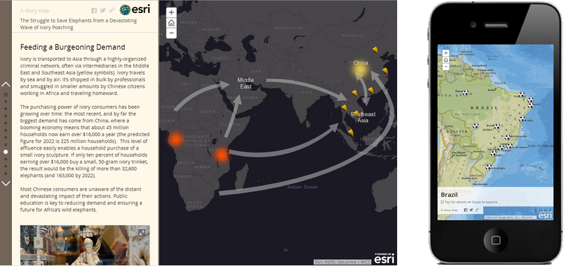
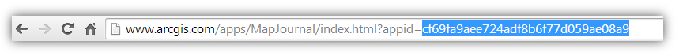

Story Map Journal
=================

The Story Map Journal is ideal when you want to combine narrative text with maps and other embedded content. A Map Journal contains entries, or sections, that users simply scroll through. Each section in a Map Journal has an associated map, image, video or web page. Actions can also be defined in journal sections so that, for example, clicking a word automatically zooms the section’s map to a particular location.



[View it live](http://links.esri.com/storymaps/map_journal_example_side_panel) | 
[Map Journal page on Esri Story Maps website](http://storymaps.arcgis.com/en/app-list/map-journal/) |
[Download](http://links.esri.com/storymaps/map_journal_template_zip)

**Latest release is version 1.3.0**, if you want to be informed of new releases, we recommend you to watch this repository ([see GitHub help](https://help.github.com/articles/watching-repositories)). See the [release page](https://github.com/Esri/map-journal-storytelling-template-js/releases) for release notes.

## Help content

 * [Introduction](#introduction)
 * [Instructions](#instructions)
 * [Feedback / support](#feedback--support)
 * [FAQ](#faq)
 * [Configuration](#configuration)
 * [Customize the look and feel](#customize-the-look-and-feel)
 * [Developer guide](#developer-guide)
 * [Issues](#issues)
 * [Contributing](#contributing)
 * [Licensing](#licensing)

## Introduction
A Map Journal application can be created from [ArcGIS Online](http://arcgis.com), from the [Esri Story Maps website](http://storymaps.arcgis.com/) or from a [Portal for ArcGIS](http://www.esri.com/software/arcgis/arcgisserver/extensions/portal-for-arcgis) deployment. The Journal's data are stored in a Web Application Item (this includes the narrative content, reference to the webmap(s), pictures, videos and the settings).
This repository provides the application source code for developers that want to customize Map Journal.

For more information about the Map Journal, including a gallery of examples and a step-by-step tutorial, please see the [Map Journal](http://storymaps.arcgis.com/en/app-list/map-journal/) page on the [Esri Story Maps website](http://storymaps.arcgis.com/).

## Instructions
First create your Map Journal in ArcGIS Online using the [step-by-step tutorial](http://storymaps.arcgis.com/en/app-list/map-journal/tutorial/).
Once your story is ready, you have to find its ID in ArcGIS Online. The ID is a 32 character string that you will find in your web browser's address bar when you are viewing your journal.



1. [Download the application](http://links.esri.com/storymaps/map_journal_template_zip)
2. Deploy the application on your webserver. See [FAQ](#how-to-deploy-the-application-on-a-web-server) for details
3. Edit index.html, find the configuration section on line 38 and paste in your application ID
4. Navigate to index.html (e.g., `http://127.0.0.1/MapJournal/index.html`)

Enjoy!
You can continue to use the builder in ArcGIS Online to modify your story.
See [customize the look and feel section](#customize-the-look-and-feel) or [developer guide](#developer-guide) if you want to modify the app.

## Feedback / support
We would love to hear from you!
* [StoryMaps Website](http://storymaps.arcgis.com/)
* [Let us know about your application](http://storymaps.arcgis.com/en/gallery/submission-form/)
* [Story Maps forum on GeoNet](http://links.esri.com/storymaps/story_maps_geonet)
* [@EsriStoryMaps](http://twitter.com/EsriStoryMaps)
* [ArcGIS Blog](http://blogs.esri.com/esri/arcgis/)

When you contact us, don't hesitate to include a link to your application to make it easier for us to understand what you are working on.

## FAQ

### What should I check before publishing a Journal?
We recommend that you perform the following checks before sharing your Journal with your audience:
 - Check that all your Journal's content is shared with your audience (webmaps, medias, ...). Typically you can use another computer than the one you have used to build your story to make sure everything is loading properly. Alternatively [this article](http://browsers.about.com/od/faq/tp/Incognito-Browsing.htm) will show you how to configure your browser for an incognito session or you can just sign-out from ArcGIS Online and any service that you have used to host your Journal's resources. 
 - Try the application on different browsers, screen resolutions and mobile devices. You can [emulate mobile  devices](http://mobiletest.me/) inside your desktop browser.

### What are the supported browsers?
Map Journal is supported on Internet Explorer 9 and above, Chrome, Firefox, Safari and the most recent tablet and smartphone devices.
Map Journal authoring is supported on Internet Explorer 10 and above, on the most recent tablet but not on smartphone.

We actively test the application in all major browsers but if you experience difficulties especially with the builder, we recommend that you use [Chrome](https://www.google.com/intl/en_us/chrome/browser/).

### Tips for your content

#### Link between sections
One [popular](https://github.com/Esri/map-journal-storytelling-template-js/issues/5) [request](https://github.com/Esri/map-journal-storytelling-template-js/issues/7) is to add the ability to navigate between Journal's sections using links in the panel or through map features popup. Until we implement that capability in the builder you can do it using HTML markup.

To add links in a section content, use the `Source button` of the text editor (second from the right on the first line) and use the following markup:

```
<p><a onclick="require(['dojo/topic'], function(topic){ topic.publish('story-navigate-section', 0); });">Navigate to home section</a></p>
<p><a onclick="require(['dojo/topic'], function(topic){ topic.publish('story-navigate-section', 2); });">Navigate to section 2</a></p>
<p><a onclick="require(['dojo/topic'], function(topic){ topic.publish('story-navigate-section', 4); });">Navigate to section 4</a></p>
```

You can also add that capability to map feature popups. This can for example allow the home section map to be the spatial index to your story. ArcGIS Online Map Viewer doesn't allow to create those links from the editor but if those links are present in your layer attributes before you upload your data to ArcGIS Online, it will works.

Note that the links navigate the Journal using an index that start at 0 for the Home Section. If you remove or reorder your sections, you will have to modify the links manually.


### Security

#### Can I keep my Journal private?
Yes, the regular ArcGIS Online security model applies. 
By default your Journal is private, you can share it through Map Journal builder or ArcGIS Online. 
When you share your Journal, it is your responsibility to make sure that all the resources of your Journal (webmaps, images, videos) are accessible to your audience.

#### Who can edit my Journal?
A Journal can only be edited by its owner (the named account that initially created the Journal). Organization Administrator (does not apply for public account) can take or give the Journal's ownership to another user. In that case you won't anymore be able to edit the Journal. Changing the ownership is the only way to collaborate on a Journal creation without sharing the owner's credentials.

#### Can I use private web map or layer?
Yes. 

When the Journal is hosted in ArcGIS Online or Portal for ArcGIS, users that don't have access to the Journal or a webmap used in the Journal will be redirected to the ArcGIS Online sign-in page. It is not possible to display an authentication dialog in the Map Journal when the Journal is hosted in ArcGIS Online.

To use a premium layer in a public webmap, [follow that procedure](http://blogs.esri.com/esri/arcgis/2014/10/07/public-access-to-arcgis-online-premium-services/).

When the Journal is hosted on your web server, an authentication dialog will appear inside the application. 

Note that for that authentication to work on some older browser (Internet Explorer 9) you need to install a proxy server on your web server to make sure the login credentials can be passed securely to ArcGIS Online. For more information, see the [Using the proxy](https://developers.arcgis.com/javascript/jshelp/ags_proxy.html) in the ArcGIS API for JavaScript documentation.

Because of that limitation, we recommend that you configure the application to use OAuth. OAuth 2.0 based authentication is available for ArcGIS Online and Portal for ArcGIS users with developer or organizational accounts. Follow the procedure to [add an application](http://doc.arcgis.com/en/arcgis-online/share-maps/add-items.htm#ESRI_SECTION1_55703F1EE9C845C3B07BBD85221FB074) and [register an application](http://doc.arcgis.com/en/arcgis-online/share-maps/add-items.htm#ESRI_SECTION2_20AF85308FD548B5ADBAE28836F66D3F) to get an OAuth application ID. Once you have that application, open `index.html`, locate the `configOptions` section and fill the `oAuthAppId` property.

### Deployment
Deploying a Map Journal require to use ArcGIS Online or Portal for ArcGIS. The Journal content have to be created using the Map Journal builder and will live in a Web Application Item.

#### Can I use the template without ArcGIS Online or Portal for ArcGIS?
This is not a supported use case at that time. Please let us know if you are interested by such a scenario. 
Map Journal rely heavily on the Portal for ArcGIS API but it is doable to modify the application to support other scenarios.

#### Where is the data stored?
The Journal's data are stored in a Web Application Item in ArcGIS Online or Portal for ArcGIS. This include the narrative content, reference to the webmap(s), reference to picture(s), video(s), web page(s) and the settings.

The image and videos that you include in your Journal using the builder are not copied in ArcGIS Online. You have to make sure that those medias as well as the webmaps you are using are and will remain accessible to your audience.

#### Can I deploy Map Journal on Portal for ArcGIS?
Yes, Map Journal is included with Portal for ArcGIS starting at version 10.3.

If you are using a previous version of Portal, you will have to deploy the following version [Map Journal V1.0.2 - portal](https://github.com/Esri/map-journal-storytelling-template-js/releases/download/V1.0.2/Storytelling-MapJournal-1.0.2-portal.zip) in the following folder `ArcGIS\Portal\webapps\arcgis#home\webmap\templates\MapJournal`. 

Note that when using Portal 10.2.1 or 10.2.2, it is required that you use Map Journal V1.0.2 or below and the JS API in version 3.9 (Map Journal V1.1 and above are not compatible, JS API 3.10 and above are not compatible). The previous link is the only version of Map Journal that is compatible with Portal 10.2.1 or 10.2.2. That version use the Javascript API V3.9 hosted in ArcGIS Online, optionaly you can modify it to use the API included on your Portal. To change the JavaScript API, edit `index.html` and locate `pathJSAPI` around line 75. 

If the folder `ArcGIS\Portal\webapps\arcgis#home\webmap\templates\MapJournal` already contain a previous version, make sure to first delete all of its content. Then refer your Portal documentation for instructions on [publishing a new web application item](http://resources.arcgis.com/en/help/main/10.2/index.html#/Adding_applications/019300000031000000/) and adding it to a group and [configuring the web application gallery](http://resources.arcgis.com/en/help/main/10.2/index.html#/Configure_map_viewer/017s00000024000000/) to use that group. If you choose to deploy the template in another folder, some configuration will be required (see the configuration section in index.html). 

Also note that the web application gallery preview feature redirects to the StoryMaps website, the target page can be modified in `app/config.js > HELP_URL`.

#### Can the template be used offline?
Yes, by using Portal for ArcGIS and configuring the template to use the ArcGIS API for Javascript included with the Portal. 

To edit the JavaScript API, edit `index.html` and locate `pathJSAPI` around line 75. 

When deployed on a Portal for ArcGIS instance, the application doesn't require any external service to function. But by default the template will still include the header social buttons and Journal author are able to import pictures and videos from the some online pictures hosting services. These options can be disabled individually through the configuration file `app/config.js`.

#### Can I use the builder with the downloadable?
Yes, when the template is configured with an application ID, adding the URL parameter 'edit' will open the builder. You will be prompted for user authentication through the Identity Manager.

#### How to deploy the application on a web server?
If you are not familiar with web servers here is three solutions:
 * Use a free hosting service like [Dropbox](https://www.dropbox.com), you may have to [configure Dropbox to enable webpage hosting](https://www.dropbox.com/enable_public_folder)
 * Use the web server that comes with your server Operating System. On Windows this is Internet Information Services (IIS), if you have a `C:\inetpub\wwwroot` folder on your computer, you should be able to access it's content using `http://localhost`
 * On Windows or Mac OS, use a simple web server like [Mongoose](https://code.google.com/p/mongoose/) (not recommended for production)

If you are experiencing some rendering issues like improper symbol appearing instead of icons, you will have an extra configuration to perform. Some servers require to configure a new mime type to be able to serve Map Journal fonts correctly. See the following links for more information:

 * [IIS Mime types](http://codingstill.com/2013/01/set-mime-types-for-web-fonts-in-iis/)
 * [Properly serve webfonts](http://blog.symbolset.com/properly-serve-webfonts)

#### Can I use a single deployment of Map Journal for multiple stories?
Yes. 
If you have customized the application and deployed it on your server, you don't need to copy it multiple times, edit index.html and paste a different application ID for each story you want to publish. 

Instead edit `index.html`, locate the `configOptions` section and fill the `authorizedOwners` property with the ArcGIS Online or Portal for ArcGIS login of the owner(s) of the Journals you want to use. This make possible for the application to display  any of the Journal created by the specified user(s) through an URL parameter.

Example of the same application displaying two stories:
 * http://myserver.com/MapJournal/index.html?appid=c7ad1a55de0247a68454a76f251225a4
 * http://myserver.com/MapJournal/index.html?appid=c7ad1a55de0247a68454a76f251225a5

## Configuration
In addition to the configuration offered by the builder, the files `app/config.js` and `app/commonConfig.js` provide various settings. Documentation is provided in those files.

## Customize the look and feel

### Custom color theme
As Map Journal doesn't yet offer the ability to create a custom theme through the builder, customizing the various colors of the application require to download and configure them through `app/config.js`.

For example if you are using a Side Panel layout and have kept the default theme, open `app/config.js`, locate the `LAYOUT` property and edit the following line with the desired colors.

```
themes: [
  {name: "side-default-1", dotNav: "#777777", panel: "#FFFFFF", media: "#EEEEEE", text: "#000000", textLink: "#555", esriLogo: "black"},
  ...
  ]
```

### Other customization
Most of the look and feel customization can be done using the [regular Application Download](http://links.esri.com/storymaps/map_journal_template_zip) and including the css/html overrides directly into `index.html`. 

As the application Javascript and CSS are minified, **we don't recommend that you directely edit those files** (e.g. `app-viewer-min.css`, `app-viewer-min.js`, ...). In addition to being hard to edit, this will make application update complex for you.

If you want to change the behavior of one functionality or want to add new one, follow the [developer guide](#developer-guide) below.

The easiest way to find the id or path of a DOM element that you want to customize is to use your browser developer tool, read documentation for [Chrome](https://developers.google.com/chrome-developer-tools/), [Safari](https://developer.apple.com/library/safari/documentation/AppleApplications/Conceptual/Safari_Developer_Guide/Introduction/Introduction.html), [Firefox](https://getfirebug.com/).

Here is some customization examples that can achieved through the `style` tag already present for you in `index.html` (search for `/* CUSTOM CSS RULES */`):

#### Use an image as the background of the Side or Floating panel header

```
...
<body class="claro">
  <style>
    /* CUSTOM CSS RULES */
    .sectionPanel .header {
      background: url('http://www.esri.com/~/media/banner-map1.jpg');
    }

    .sectionPanel .appTitle {
      background: url('http://www.esri.com/~/media/banner-map1.jpg');
      background-position: 0 -50px;
    }
  </style>
...
```

## Developer guide
This developer guide is intended for developers that wants to modify the behavior or add new functionalities to the Map Journal application. 
It requires knowledge of HTML, Javascript and CSS languages.
If you only need to customize look and feel, you should be able to do so using the [customize section above](#customize-the-look-and-feel).

### Application life cycle
Map Journal fires events that allow customization with lose integration. This mean that you don't need to understand the application internals to implement simple extension.

To try those events, look for the `Custom Javascript` block at the far end of index.html.

```
...
require(["dojo/topic"], function(topic) {
  /*
   * Custom Javascript to be executed while the application is initializing goes here
   */
   
  console.log("Map Journal is initializing");
  
  // The application is ready
  topic.subscribe("tpl-ready", function(){
    /*
     * Custom Javascript to be executed when the application is ready goes here
     */
     
    console.log("Map Journal is ready");
  });
  
  // When a section is being loaded (don't wait for the Main Stage media to be loaded) 
  topic.subscribe("story-load-section", function(index){
    console.log("The section", index, "is being loaded");
  });
  
  // After a map is loaded (when the map starts to render)	
  topic.subscribe("story-loaded-map", function(result){
    if ( result.index !== null )
      console.log("The map", result.id, "has been loaded from the section", result.index);
    else
      console.log("The map", result.id, "has been loaded from a Main Stage Action");
  });
  
  // When a main stage action that load a new media or reconfigure the current media is performed
  // Note that this even is not fired for the "Locate and address or a place action"
  topic.subscribe("story-perform-action-media", function(media){
    console.log("A Main Stage action is performed:", media);
  });
});
...
```

### Developer helpers
In addition to the events described above, the story data, configuration and useful helpers functions can be accessed through the global variable `app`.

```
console.log("Section", app.data.getCurrentSectionIndex(), "/", app.data.getStoryLength());
console.log("Current map", app.map);
console.log("IDs of all the webmaps used in the story", app.data.getWebmaps());
console.log("Current section's data", app.data.getCurrentSection());
console.log("All sections data", app.data.getStorySections());
console.log("Story layout configuration", app.data.getWebAppData().get().values.settings.layoutOptions);
console.log("Static ayout configuration values", app.data.getCurrentLayoutStaticConfig());
```

Some events are also available for you to navigate the Journal programmatically:

```
require(["dojo/topic"], function(topic) { 
  // Navigate to a section
  topic.publish("story-navigate-section", 2);
  
  // Reload the content panel
  topic.publish("story-update-sections");
  
  // Update a specific section content panel
  topic.publish("story-update-section", 2);
});
```

### Environment setup

Clone the repository or download a [copy of the repository as a zip file](https://github.com/Esri/map-journal-storytelling-template-js/archive/master.zip).

To build a production version of the application from the source code, you first need to install [Node.js](http://nodejs.org/).

Then initialize the environment by running the following commands **in the MapJournal folder**:
 * `npm install`
 * `npm install –g grunt-cli`

This will create a new `node-modules` folder in your project root with all the tools required to build the application. If you have trouble running the second command, [see this documentation on how to install grunt-cli locally](https://github.com/gruntjs/grunt-cli#installing-grunt-cli-locally).

### How to use the application from the source code
 * Make accessible the MapJournal folder on a web server. Use your favorite server or run one with `grunt server`, this will start a server on port `8080`
 * If using a Portal for ArcGIS instance configure the sharing url `app/config.js` (last property)
 * Use the URL parameter `appid` to specify the web item to be loaded, e.g.: http://localhost:8080/?appid=ABCD (configuring index.html > configOptions.appid is not supported in development mode)

### How to build application from the source code
  * Open a terminal and navigate to the MapJournal folder 
  * Run the following command: `grunt`

The deploy folder now contains the built application that you can deploy to your web server.

### Issues building the application

The build script perform code validation through [JSHint](http://www.jshint.com/), you can disable those validations by editing Gruntfile.js and look for the following comments `/* Comment out to disable code linting */`.

### Design
Map Journal relies on AMD and Dojo loader [AMD](http://help.arcgis.com/en/webapi/javascript/arcgis/jshelp/#inside_dojo_amd) for application structure.

The application is structured as this:

| Path          			                  	| Contains																						|
| ---------------------------------------------	|  -------------------------------------------------------------------------------------------- |
| Gruntfile.js									| Build configuration																			|
| src/											| Main source code folder with index.html and the Eclipse project configuration							|
| src/app/										| Javascript and CSS source code 																|
| src/app/config.js			            		| App configuration file (loaded at execution time) 											|
| src/app/commonConfig.js			            | More configuration (only used when deployed outside of ArcGIS Online and Portal for ArcGIS)	|
| **src/app/storymaps/common/**						| Modules common across storymaps templates (main module is Core.js)							|
| src/app/storymaps/common/builder/				| Builder modules (main module is Builder.js)													|
| src/app/storymaps/common/mapcontrols/			| Map UI components (Overview, Legend)															|
| src/app/storymaps/common/ui/					| UI components																					|
| src/app/storymaps/common/utils/				| Utils, connector,...																			|
| src/app/storymaps/common/_resources			| Static resources																				|
| **src/app/storymaps/tpl/**						| Map Journal modules (build configuration files in the root)									|
| src/app/storymaps/tpl/builder/				| Builder modules (main module is BuilderView.js)												|
| src/app/storymaps/tpl/core/					| Core modules (main module is MainView.js) 													|
| src/app/storymaps/tpl/ui/						| UI components of the viewer grouped by target device											|
| src/lib-app/									| Dependencies (included in the final app)														|
| src/lib-build/								| Dependencies used by the build (not included in final app)									|
| src/resources/								| Static resources																				|


The main dependencies are:
 * [jQuery](http://jquery.com/)
 * [Bootstrap](http://twitter.github.com/bootstrap/)
 * [CKEditor](http://ckeditor.com/)
 * [iDangero.us Swiper](http://www.idangero.us/sliders/swiper/)

The application Javascript and CSS are minified into four files:

| File			|										|
| --------------------- | ----------------------------------------------------------------------------- |
| app/viewer-min.css	| Compressed CSS loaded when accessing the Map Journal as a viewer		|
| app/viewer-min.js	| Compressed Javascript loaded when accessing the Map Journal as a viewer	|
| app/builder-min.css	| Compressed CSS loaded when accessing the Map Journal as an author		|
| app/builder-min.js	| Compressed Javascript loaded when accessing the Map Journal as an author	|

Depending on the URL parameters, index.html will load the corresponding files.

## Issues
Find a bug or want to request a new feature?  Please let us know by submitting an issue.

## Contributing
Esri welcomes contributions from anyone and everyone. Please see our [guidelines for contributing](https://github.com/esri/contributing).

## Licensing
Copyright 2013 Esri

Licensed under the Apache License, Version 2.0 (the "License");
you may not use this file except in compliance with the License.
You may obtain a copy of the License at

   http://www.apache.org/licenses/LICENSE-2.0

Unless required by applicable law or agreed to in writing, software
distributed under the License is distributed on an "AS IS" BASIS,
WITHOUT WARRANTIES OR CONDITIONS OF ANY KIND, either express or implied.
See the License for the specific language governing permissions and
limitations under the License.

A copy of the license is available in the repository's [LICENSE.txt](LICENSE.txt) file.

Some open-source components of this project are licensed under other License terms, see `src/lib-app/` folder for respective licence files.

| Library               | License   |
| --------------------- | --------- |
| Bootstrap 			| MIT 		|
| CKEditor 				| LGPL		|
| jQuery 				| MIT 		|
| jQuery Colorbox 		| MIT 		|
| iDangero.us swiper 	| MIT 		|
| ZeroClipboard 		| MIT 		|
| History.js			| BSD 		|
| jQuery UI 			| MIT 		|
| FastClick 			| MIT 		|
| Hammer.JS 			| MIT 		| 
| jQuery mousewheel 	| MIT 		|
| jQuery UI Touch Punch | MIT 		|

[](Esri Tags: Storytelling MapJournal ArcGIS-Online Template Map Journal)
[](Esri Language: JavaScript)
